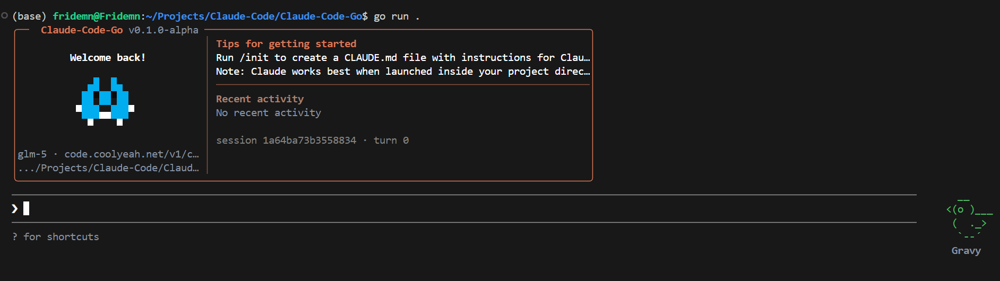
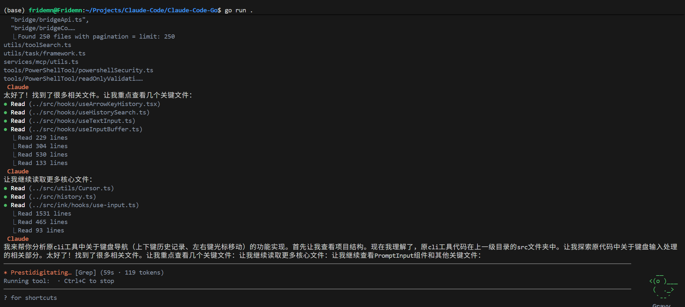

# Claude-Code-Go

> **⚠️ Disclaimer**: This project is for learning and research purposes only. It does not represent the official internal development repository structure.

English Version | [中文版](README.md)

A personal Claude Code CLI re-ported from TypeScript to Go.




## Note

This project will continue to be updated as long as the original repository exists. Please excuse any issues or omissions — feel free to submit an Issue or PR. The goal is to maintain parity with the original repository while removing Anthropic-specific dependencies and supporting OpenAI-compatible APIs via `.env` configuration.

## Migration Progress

### Core Architecture (Completed)

| Module | Status | Description |
|--------|--------|-------------|
| `cmd -> app -> engine -> provider -> session` | ✅ | Main call chain complete |
| `config` | ✅ | `.env` configuration loading |
| `session` | ✅ | Session history persistence |
| `engine` | ✅ | Message loop, tool calls, streaming |
| `ui` | ✅ | Bubble Tea TUI, rendering, collapsing, scrollback |

### Tools

| Original TS Tool | Go Implementation | Status |
|------------------|-------------------|--------|
| BashTool | `internal/tool/bash` | ✅ |
| PowerShellTool | `internal/tool/bash` | ✅ |
| FileReadTool | `internal/tool/file` | ✅ |
| FileWriteTool | `internal/tool/file` | ✅ |
| FileEditTool | `internal/tool/file` | ✅ |
| GlobTool | `internal/tool/file` + `internal/tool/search` | ✅ |
| GrepTool | `internal/tool/search` | ✅ |
| AgentTool | `internal/tool/agent` | ✅ |
| BriefTool | `internal/tool/agent` | ✅ |
| SendMessageTool | `internal/tool/agent` | ✅ |
| TaskCreateTool | `internal/tool/task` | ✅ |
| TaskGetTool | `internal/tool/task` | ✅ |
| TaskListTool | `internal/tool/task` | ✅ |
| TaskOutputTool | `internal/tool/task` | ✅ |
| TaskStopTool | `internal/tool/task` | ✅ |
| TaskUpdateTool | `internal/tool/task` | ✅ |
| TodoWriteTool | `internal/tool/todo` | ✅ |
| EnterPlanModeTool | `internal/tool/plan` | ✅ |
| ExitPlanModeTool | `internal/tool/plan` | ✅ |
| EnterWorktreeTool | `internal/tool/worktree` | ✅ |
| ExitWorktreeTool | `internal/tool/worktree` | ✅ |
| AskUserQuestionTool | `internal/tool/interaction` | ✅ |
| MCPTool | `internal/tool/mcp` | ✅ |
| ListMcpResourcesTool | `internal/tool/mcp` | ✅ |
| ReadMcpResourceTool | `internal/tool/mcp` | ✅ |
| McpAuthTool | `internal/tool/mcp` | ✅ |
| LSPTool | `internal/tool/lsp` | ✅ |
| NotebookEditTool | `internal/tool/notebook` | ✅ |
| ConfigTool | `internal/tool/config` | ✅ |
| SkillTool | `internal/tool/skill` | ✅ |
| TeamCreateTool | `internal/tool/team` | ✅ |
| TeamDeleteTool | `internal/tool/team` | ✅ |
| SleepTool | `internal/tool/sleep` | ✅ |
| SyntheticOutputTool | `internal/tool/output` | ✅ |
| REPLTool | `internal/tool/repl` | ✅ |
| ScheduleCronTool | `internal/tool/schedule` | ✅ |
| RemoteTriggerTool | `internal/tool/schedule` | ✅ |
| WebFetchTool | `internal/tool/web` | ✅ |
| WebSearchTool | `internal/tool/web` | ✅ |
| ToolSearchTool | `internal/tool/search` | ✅ |

### Slash Commands

| Original TS Command | Go Implementation | Status |
|---------------------|-------------------|--------|
| `/help` | `internal/command/help` | ✅ |
| `/files` | `internal/command/files` | ✅ |
| `/memory` | `internal/command/memory` | ✅ |
| `/mcp` | `internal/command/integration` | ✅ |
| `/plugins` | `internal/command/integration` | ✅ |
| `/hooks` | `internal/command/integration` | ✅ |
| `/agents` | `internal/command/agent` | ✅ |
| `/skills` | `internal/command/skills` | ✅ |
| `/session` | `internal/command/session` | ✅ |
| `/compact` | `internal/command/meta` | ✅ |
| `/prompt` | `internal/command/prompt` | ✅ |
| `/doctor` | `internal/command/dev` | ✅ |
| `/diff` | `internal/command/dev` | ✅ |
| `/usage` | `internal/command/stats` | ✅ |
| `/stats` | `internal/command/stats` | ✅ |
| `/login` | - | ❌ (Anthropic-specific) |
| `/logout` | - | ❌ (Anthropic-specific) |
| `/cost` | - | 🔄 Pending |
| `/model` | - | 🔄 Pending |
| `/config` | - | 🔄 Pending |

### Extension System

| Module | Status | Description |
|--------|--------|-------------|
| MCP | ✅ | Local JSON config, dynamic tools |
| Plugins | ✅ | Local JSON config, dynamic commands |
| Hooks | ✅ | Local JSON config, event triggers |
| Skills | ✅ | Local Markdown files |
| Memory | ✅ | Persistent memory system |

### Not Migrated

| Module | Reason |
|--------|--------|
| `login/logout` | Anthropic OAuth specific |
| `bridge` | Anthropic desktop bridge |
| `remote-env` | Anthropic remote environment |
| `voice` | Voice input relies on Anthropic services |
| `mobile` | Mobile sync |
| `insights` | Usage analytics |
| `ultraplan` | Advanced planning mode |

## Directory Structure

```text
Claude-Code-Go/
├── cmd/                      # CLI entry points
│   ├── root.go
│   ├── chat.go
│   ├── config.go
│   └── test.go
├── internal/
│   ├── api/                  # OpenAI-compatible API client
│   ├── app/                  # Application layer
│   ├── agent/                # Sub-agent management
│   ├── bootstrap/            # Bootstrap state
│   ├── bridge/               # Bridge client (reserved)
│   ├── command/              # Slash commands
│   ├── components/           # TUI components
│   ├── config/               # Configuration loading
│   ├── engine/               # Message engine
│   ├── infra/                # Infrastructure
│   ├── memory/               # Memory system
│   ├── prompt/               # System prompts
│   ├── services/             # Service container
│   ├── session/              # Session management
│   ├── state/                # State management
│   ├── task/                 # Task tracking
│   ├── tool/                 # Tool definitions
│   ├── types/                # Type definitions
│   ├── ui/                   # Terminal UI
│   └── utils/                # Utilities
├── tests/                    # Test files
├── .env.example
└── main.go
```

## Configuration

Copy `.env.example` to `.env`:

```env
# Required
CLAUDE_CODE_API_KEY=your_api_key
CLAUDE_CODE_BASE_URL=https://api.openai.com/v1/chat/completions
CLAUDE_CODE_MODEL=gpt-4.1

# Optional
CLAUDE_CODE_MCP_CONFIG=.claude-code-go/mcp.json
CLAUDE_CODE_PLUGINS_CONFIG=.claude-code-go/plugins.json
CLAUDE_CODE_HOOKS_CONFIG=.claude-code-go/hooks.json
CLAUDE_CODE_SESSION_DIR=.claude-code-go/sessions
CLAUDE_CODE_SYSTEM_PROMPT=
```

### Configuration Reference

| Variable | Description | Default |
|----------|-------------|---------|
| `CLAUDE_CODE_API_KEY` | API key | - |
| `CLAUDE_CODE_BASE_URL` | Full request URL, no path auto-concatenation | - |
| `CLAUDE_CODE_MODEL` | Model name | `gpt-4.1` |
| `CLAUDE_CODE_MCP_CONFIG` | MCP config file path | - |
| `CLAUDE_CODE_PLUGINS_CONFIG` | Plugins config file path | - |
| `CLAUDE_CODE_HOOKS_CONFIG` | Hooks config file path | - |
| `CLAUDE_CODE_SESSION_DIR` | Session storage directory | `.claude-code-go/sessions` |

### MCP Config Example (`mcp.json`)

```json
{
  "servers": [
    {
      "name": "filesystem",
      "command": "mcp-server-filesystem",
      "args": ["--root", "/path/to/project"],
      "enabled": true
    }
  ]
}
```

### Plugins Config Example (`plugins.json`)

```json
{
  "plugins": [
    {
      "name": "my-plugin",
      "path": "./plugins/my-plugin",
      "enabled": true
    }
  ]
}
```

### Hooks Config Example (`hooks.json`)

```json
{
  "hooks": [
    {
      "event": "PreToolUse",
      "command": "echo 'Tool about to be used'",
      "blocking": false
    }
  ]
}
```

## Usage

### Start Interactive Session

```bash
go run .
```

### Subcommands

```bash
go run . chat      # Start interactive chat (default)
go run . config    # Show current configuration
go run . test      # Run tests
go run . version   # Show version
```

### Interactive Slash Commands

In a chat session:

| Command | Description |
|---------|-------------|
| `/help` | Show help |
| `/files [pattern]` | List files |
| `/memory` | Manage memory |
| `/mcp` | MCP server management |
| `/plugins` | Plugin management |
| `/hooks` | Hooks management |
| `/agents` | Sub-agent management |
| `/skills` | Skills management |
| `/session` | Session management |
| `/compact` | Compact context |
| `/prompt` | View/edit prompts |
| `/doctor` | Diagnostics |
| `/diff` | Show differences |
| `/usage` | Usage statistics |
| `/stats` | Statistics |

### Vim Mode Shortcuts

| Shortcut | Description |
|----------|-------------|
| `i` | Enter insert mode |
| `Esc` | Exit insert mode |
| `k` | Previous history |
| `j` | Next history |
| `Ctrl+C` | Interrupt current operation |
| `Ctrl+D` | Exit |

## Testing

```bash
# Run all tests
go test ./tests/...

# Run specific test
go test ./tests/... -run TestBashTool

# Via entry point
go run . test
```

## Migration Principles

1. **Behavior first**: Maintain the same user experience as the original CLI
2. **Module mapping**: Keep `engine / tool / command / session / config` layering
3. **Incremental migration**: Complete main chain first, then add advanced features
4. **Remove proprietary**: Strip `anthropic`, `oauth`, `bridge` dependencies

## Differences from Original

| Feature | Original TS | Go Version |
|---------|-------------|------------|
| Authentication | Anthropic OAuth | API Key direct config |
| API | Anthropic API | OpenAI-compatible API |
| Models | Claude series | Any compatible model |
| Desktop integration | Full | None |
| Remote environment | Supported | None |
| Voice input | Supported | None |

## Development

```bash
# Build
go build -o claude-code-go .

# Run
./claude-code-go

# Dev mode (hot reload requires additional tools)
go run . chat
```
