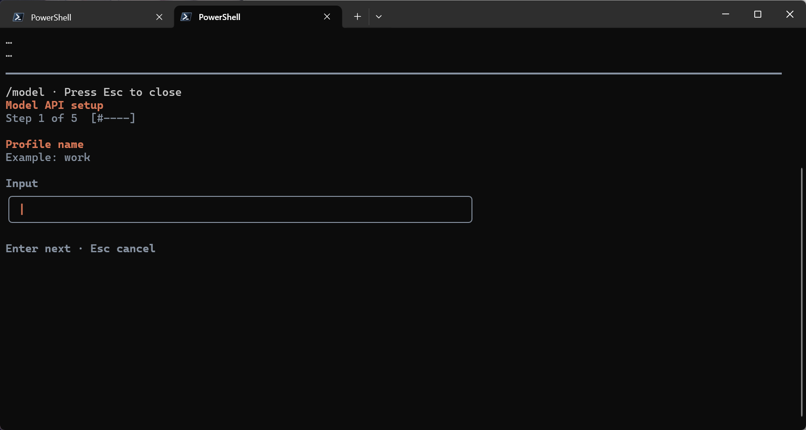

# Claude-Go

> **⚠️ Disclaimer**: This project is for learning and research purposes only. It does not represent the official internal development repository structure.

English Version | [中文版](README.md)

A personal Claude Code CLI re-ported from TypeScript to Go.

## Note

This project will continue to be updated as long as the original repository exists. Please excuse any issues or omissions — feel free to submit an Issue or PR. The goal is to maintain parity with the original repository while removing Anthropic-specific dependencies and supporting OpenAI-compatible APIs via `.env` configuration.

## Usage

Download the appropriate version from the Releases, rename it to `claude-go` (add the extension if necessary), and add it to your environment variables.

Taking Windows as an example:
You can create and extract it to the `C:/apps/claude-go` directory,
Add `C:/apps/claude-go` to the system environment variable path.
Enter `claude-go` in the terminal to use it.

On first use, enter the `/model` command in the input bar and follow the prompts to configure your LLM API and model selection.


## Migration Progress Overview

| Category | TS Original | Go Migrated | Rate |
|----------|------------|-------------|------|
| Core Architecture | 8 modules | 8 modules | 100% |
| Tools | 42 | 42 | 100% |
| Slash Commands | ~80 | ~30 | ~38% |
| Services | 15+ subsystems | 12 subsystems | ~80% |
| Extension Systems | 5 subsystems | 5 subsystems | 100% |

## Core Architecture (Completed)

| Module | Status | Description |
|--------|--------|-------------|
| `cmd -> app -> engine -> provider -> session` | ✅ | Main call chain complete |
| `config` | ✅ | `.env` config loading, multi-source merge |
| `session` | ✅ | Session history persistence, resume |
| `engine` | ✅ | Message loop, tool calls, streaming |
| `ui` | ✅ | Bubble Tea TUI, rendering, collapsing, scrollback |
| `provider` | ✅ | OpenAI-compatible LLM Provider |
| `agent` | ✅ | Sub-agent registry, definitions, forking |
| `types` | ✅ | Message, permission, attachment, hook types |

## Tools

### File Operations

| Original TS Tool | Go Implementation | Status |
|------------------|-------------------|--------|
| FileReadTool | `internal/tool/file/read.go` | ✅ |
| FileWriteTool | `internal/tool/file/write.go` | ✅ |
| FileEditTool | `internal/tool/file/edit.go` | ✅ |
| GlobTool | `internal/tool/file` + `internal/tool/search` | ✅ |
| GrepTool | `internal/tool/search` | ✅ |
| NotebookEditTool | `internal/tool/notebook` | ✅ |

### Execution Environment

| Original TS Tool | Go Implementation | Status |
|------------------|-------------------|--------|
| BashTool | `internal/tool/bash` | ✅ |
| PowerShellTool | `internal/tool/bash` (with powershell_*.go) | ✅ |

### Agent & Collaboration

| Original TS Tool | Go Implementation | Status |
|------------------|-------------------|--------|
| AgentTool | `internal/tool/agent` | ✅ |
| BriefTool | `internal/tool/agent` | ✅ |
| SendMessageTool | `internal/tool/agent` | ✅ |
| TeamCreateTool | `internal/tool/team` | ✅ |
| TeamDeleteTool | `internal/tool/team` | ✅ |

### Task Management

| Original TS Tool | Go Implementation | Status |
|------------------|-------------------|--------|
| TaskCreateTool | `internal/tool/task` | ✅ |
| TaskGetTool | `internal/tool/task` | ✅ |
| TaskListTool | `internal/tool/task` | ✅ |
| TaskOutputTool | `internal/tool/task` | ✅ |
| TaskStopTool | `internal/tool/task` | ✅ |
| TaskUpdateTool | `internal/tool/task` | ✅ |
| TodoWriteTool | `internal/tool/todo` | ✅ |

### Planning & Worktree

| Original TS Tool | Go Implementation | Status |
|------------------|-------------------|--------|
| EnterPlanModeTool | `internal/tool/plan` | ✅ |
| ExitPlanModeTool | `internal/tool/plan` | ✅ |
| EnterWorktreeTool | `internal/tool/worktree` | ✅ |
| ExitWorktreeTool | `internal/tool/worktree` | ✅ |

### Interaction & UI

| Original TS Tool | Go Implementation | Status |
|------------------|-------------------|--------|
| AskUserQuestionTool | `internal/tool/interaction` | ✅ |
| SleepTool | `internal/tool/sleep` | ✅ |
| SyntheticOutputTool | `internal/tool/output` | ✅ |
| REPLTool | `internal/tool/repl` | ✅ |

### Extensions & Integration

| Original TS Tool | Go Implementation | Status |
|------------------|-------------------|--------|
| MCPTool | `internal/tool/mcp` | ✅ |
| ListMcpResourcesTool | `internal/tool/mcp` | ✅ |
| ReadMcpResourceTool | `internal/tool/mcp` | ✅ |
| McpAuthTool | `internal/tool/mcp` | ✅ |
| LSPTool | `internal/tool/lsp` | ✅ |
| ConfigTool | `internal/tool/config` | ✅ |
| SkillTool | `internal/tool/skill` | ✅ |
| ScheduleCronTool | `internal/tool/schedule` | ✅ |
| RemoteTriggerTool | `internal/tool/schedule` | ✅ |

### Search & Web

| Original TS Tool | Go Implementation | Status |
|------------------|-------------------|--------|
| WebFetchTool | `internal/tool/web` | ✅ |
| WebSearchTool | `internal/tool/web` | ✅ |
| ToolSearchTool | `internal/tool/search` | ✅ |
| ImageProcessor | `internal/tool/image` | ✅ |

## Slash Commands

### Completed

| Original TS Command | Go Implementation | Description |
|---------------------|-------------------|-------------|
| `/help` | `internal/command/help` | Help |
| `/files [pattern]` | `internal/command/files` | File browser |
| `/grep` | `internal/command/files/grep.go` | Content search |
| `/read` | `internal/command/files/read.go` | File read |
| `/memory` | `internal/command/memory` | Memory management |
| `/mcp` | `internal/command/integration/mcp.go` | MCP server management |
| `/plugins` | `internal/command/integration/plugins.go` | Plugin management |
| `/hooks` | `internal/command/integration/hooks.go` | Hooks management |
| `/agents` | `internal/command/agent` | Sub-agent management |
| `/skills` | `internal/command/skills` | Skills management |
| `/session` | `internal/command/session` | Session management |
| `/compact` | `internal/command/meta` | Context compaction |
| `/doctor` | `internal/command/dev` | Diagnostics |
| `/diff` | `internal/command/dev` | Diff display |
| `/usage` | `internal/command/stats/usage.go` | Usage statistics |
| `/stats` | `internal/command/stats` | Stats panel |
| `/stats/effort` | `internal/command/stats/effort.go` | Effort control |
| `/stats/status` | `internal/command/stats/status.go` | Status display |
| `/stats/tools` | `internal/command/stats/tools.go` | Tools statistics |
| `/model` | `internal/command/model` | Model switching |
| `/config` | `internal/command/config` | Configuration |
| `/btw` | `internal/command/btw` | Quick note |
| `/context` | `internal/command/context` | Context management |
| `/fast` | `internal/command/fast` | Fast mode toggle |
| `/ide` | `internal/command/ide` | IDE integration |
| `/sandbox` | `internal/command/sandbox` | Sandbox management |
| `/prompt/commit` | `internal/command/prompt/commit.go` | Commit prompt |
| `/prompt/review` | `internal/command/prompt/review.go` | Code review prompt |
| `/prompt/insights` | `internal/command/prompt/insights.go` | Usage insights prompt |
| `/prompt/pr-comments` | `internal/command/prompt/pr_comments.go` | PR comments review |
| `/prompt/security-review` | `internal/command/prompt/security_review.go` | Security review |
| `/prompt/shell` | `internal/command/prompt/shell.go` | Shell prompt |

### Pending

| Command | Description | Priority |
|---------|-------------|----------|
| `/commit` | Git commit | High |
| `/review` | Code review | High |
| `/init` | Project init | High |
| `/resume` | Resume session | High |
| `/exit` | Exit | Medium |
| `/clear` | Clear screen | Medium |
| `/copy` | Copy message | Medium |
| `/theme` | Theme picker | Medium |
| `/color` | Agent color | Medium |
| `/plan` | Plan mode | Medium |
| `/permissions` | Permission management | Medium |
| `/branch` | Git branch | Medium |
| `/status` | Status info | Medium |
| `/tasks` | Task management | Medium |
| `/export` | Export transcript | Medium |
| `/rewind` | Session rewind | Medium |
| `/rename` | Rename session | Low |
| `/upgrade` | Upgrade check | Low |
| `/feedback` | Feedback | Low |
| `/summary` | Session summary | Low |
| `/keybindings` | Keybinding settings | Low |
| `/advisor` | Advisor mode | Low |
| `/extra-usage` | Extra usage | Low |
| `/tag` | Tag | Low |
| `/output-style` | Output style | Low |
| `/env` | Environment vars | Low |
| `/release-notes` | Changelog | Low |
| `/terminal-setup` | Terminal setup | Low |
| `/passes` | Passes management | Low |
| `/privacy-settings` | Privacy settings | Low |
| `/statusline` | Statusline toggle | Low |
| `/cost` | Cost tracking | Low |

### Not Migrated (Anthropic-specific)

| Command | Reason |
|---------|--------|
| `/login` | Anthropic OAuth-specific |
| `/logout` | Anthropic OAuth-specific |
| `/install-github-app` | Anthropic platform integration |
| `/install-slack-app` | Anthropic platform integration |
| `/oauth-refresh` | Anthropic OAuth refresh |
| `/mobile` | Mobile sync |
| `/desktop` | Desktop app integration |
| `/remote-env` | Remote environment |

## Services

| Service | Go Implementation | Status | Description |
|---------|-------------------|--------|-------------|
| API Client | `internal/api/` | ✅ | Adapter, streaming, retry, token estimation |
| Session Management | `internal/session/` | ✅ | Create, load, persist |
| Memory System | `internal/memory/` | ✅ | CLAUDE.md parsing, frontmatter, scan |
| Context Compaction | `internal/services/compact*.go` | ✅ | Auto/manual/micro compaction |
| Hooks Execution | `internal/services/hooks*.go` | ✅ | Event triggers, config |
| Permission System | `internal/services/permissions.go` | ✅ | Rule matching, interaction |
| Skills System | `internal/services/skills.go` | ✅ | Loading, discovery, bundling |
| Plugin System | `internal/services/plugins.go` | ✅ | Loading, builtin plugins |
| MCP Management | `internal/services/mcp.go` + `internal/infra/mcp/` | ✅ | Connection, transport, dynamic tools |
| LSP Integration | `internal/services/lsp_*.go` + `internal/tool/lsp/` | ✅ | Client, diagnostics |
| Settings | `internal/settings/` | ✅ | Multi-source merge, permission rules |
| System Prompts | `internal/prompt/` | ✅ | Prompt construction |
| Token Estimation | `internal/services/token_estimation.go` | ✅ | Rough token counting |
| Message Conversion | `internal/services/message_convert.go` | ✅ | API format conversion |
| Tool Summary | `internal/services/tool_use_summary.go` + `grouping.go` | ✅ | Tool result grouping display |
| Prompt Suggestion | `internal/services/prompt_suggestion.go` | ✅ | Input suggestions |
| Notifier | `internal/services/notifier.go` | ✅ | OS-level notifications |
| Memory Extraction | `internal/services/extract_memories.go` | ✅ | Auto memory extraction |
| State Management | `internal/state/` | ✅ | App state store |
| Bootstrap | `internal/bootstrap/` | ✅ | Startup state |
| JSON/Markdown Loader | `internal/services/json_loader.go` + `markdown_loader.go` | ✅ | Config/skill file loading |
| Session Memory | `internal/services/session_memory.go` | ✅ | Session-level memory |
| Load Time | `internal/services/load_time.go` | ✅ | Load time tracking |
| File Read Stub | `internal/services/file_read_stub.go` | ✅ | File state cache |
| API Microcompact | `internal/services/api_microcompact.go` | ✅ | API-level micro compaction |
| Diagnostic Tracking | `internal/services/load_time.go` | ✅ | Load time tracking |

### Not Migrated Services

| Service | Reason |
|---------|--------|
| `analytics` | Anthropic analytics platform-specific |
| `auth/oauth` | Anthropic OAuth-specific |
| `rateLimitMessages` | Rate limit messages (depends on Anthropic billing) |
| `mockRateLimits` | Rate limit mocking (testing) |
| `voiceStreamSTT` | Voice input (depends on Anthropic services) |
| `voiceKeyterms` | Voice keywords |
| `preventSleep` | Prevent system sleep |
| `diagnosticTracking` | Diagnostic tracking |
| `autoDream` | Auto Dream mode |
| `x402` | x402 payment protocol |
| `grove` | Grove service integration |
| `settingsSync` | Remote settings sync |
| `teamMemorySync` | Team memory sync |
| `remoteManagedSettings` | Remote managed settings |
| `vcr` | Record/playback |
| `SessionMemory/compact` | Session memory compaction |

## Extension Systems

| Module | Status | Description |
|--------|--------|-------------|
| MCP | ✅ | Local JSON config, dynamic tool registration, multi-transport (stdio/SSE/HTTP/WebSocket) |
| Plugins | ✅ | Local JSON config, dynamic commands, builtin plugins |
| Hooks | ✅ | Local JSON config, PreToolUse/PostToolUse events |
| Skills | ✅ | Markdown skill files, bundled skills, directory discovery |
| Memory | ✅ | Persistent memory, CLAUDE.md parsing, conditional memory |

## UI Components

| Component | Go Implementation | Description |
|-----------|-------------------|-------------|
| Chat Interface | `internal/ui/` | Bubble Tea TUI main model |
| Markdown Rendering | `internal/ui/markdown_glamour.go` | Glamour renderer |
| Message Rendering | `internal/ui/messages/` | Message display components |
| Collapsing Display | `internal/ui/collapse/` | Tool result collapsing, grouping |
| Diff Display | `internal/ui/diff/` | Diff visualization |
| Input Processing | `internal/ui/input/` | Input box, paste support |
| Status Bar | `internal/ui/status/` | Bottom status |
| Spinner | `internal/ui/spinner.go` | Loading animation |
| Terminal Management | `internal/ui/terminal.go` | Terminal size, alternate screen |
| Theme | `internal/ui/theme.go` | Color scheme |
| Dialogs | `internal/ui/dialogs/` | Model picker, permission confirm, quick open, global search |
| Component Library | `internal/ui/components/` | Virtual list, fuzzy picker, progress, tabs, etc. |
| Screen Management | `internal/ui/screen.go` | Fullscreen layout, recent activity |
| Shell Output | `internal/ui/shell/` | External shell output |

## Not Migrated

### Anthropic-specific (Will Not Port)

| Module | Reason |
|--------|--------|
| `login/logout` | Anthropic OAuth-specific |
| `bridge` | Anthropic desktop bridge |
| `remote-env` | Anthropic remote environment |
| `voice` | Voice input relies on Anthropic services |
| `mobile` | Mobile sync |
| `insights` | Usage analytics (Anthropic analytics platform) |
| `analytics` | Telemetry and analytics |
| `x402` | x402 payment protocol |
| `grove` | Grove service integration |
| `settingsSync` | Remote settings sync |
| `daemon` | Daemon mode |
| `chrome` | Chrome browser integration |
| `computer-use-mcp` | Computer use MCP |
| `ultraplan` | Advanced planning mode |

### Functionally Pending

| Module | Description |
|--------|-------------|
| `vim` mode | Full Vim keybinding system |
| `keybindings` | Custom shortcuts |
| `rewind` | Session rewind |
| `export` | Export session transcript |
| `share` | Share session |
| `advisor` | Advisor mode |
| `buddy` | Buddy mode |
| `thinkback` | Thinkback mode |
| `proactive` | Proactive mode |
| `workflows` | Workflow scripts |
| `background tasks` | Background tasks |
| `ForkSubagent` | Fork subagent |

## Directory Structure

```text
Claude-Go/
├── cmd/                      # CLI entry points
│   ├── root.go              # Root command
│   ├── chat.go              # Chat entry
│   ├── cli.go               # CLI core logic
│   ├── cli_interactive_env_test.go
│   ├── config.go            # Config display
│   ├── renderer.go          # Renderer
│   ├── session_picker.go    # Session picker
│   └── test.go              # Test entry
├── internal/
│   ├── agent/                # Sub-agent management (definition, registry, fork)
│   ├── api/                  # OpenAI-compatible API client (adapter, streaming)
│   ├── app/                  # Application layer
│   ├── bootstrap/            # Bootstrap state
│   ├── bridge/               # Bridge client (reserved)
│   ├── cli/                  # CLI Runner (interactive loop, Termios)
│   ├── command/              # Slash commands
│   │   ├── agent/           # Agent management
│   │   ├── btw/             # Quick note
│   │   ├── config/          # Config commands
│   │   ├── context/         # Context commands
│   │   ├── dev/             # Dev tools (doctor/diff)
│   │   ├── files/           # File commands (files/grep/read)
│   │   ├── help/            # Help
│   │   ├── integration/     # Integration (MCP/Plugins/Hooks/Permissions)
│   │   ├── memory/          # Memory management
│   │   ├── meta/            # Meta commands (compact)
│   │   ├── model/           # Model switching
│   │   ├── prompt/          # Prompt commands (commit/review/insights/etc.)
│   │   ├── session/         # Session management
│   │   ├── skills/          # Skills management
│   │   ├── stats/           # Stats (usage/effort/status/tools)
│   │   └── ...              # Other commands
│   ├── components/           # TUI chat components
│   ├── config/               # Config loading (API Profile)
│   ├── constants/            # Constants (API limits, messages, product info)
│   ├── engine/               # Message engine (loop, retry)
│   ├── infra/                # Infrastructure
│   │   └── mcp/             # MCP (manager, transport protocols)
│   ├── memory/               # Memory system (CLAUDE.md, frontmatter)
│   ├── prompt/               # System prompts
│   ├── provider/             # LLM Provider abstraction
│   ├── query/                # Query loop
│   ├── services/             # Service container (compact, hook, permission, skills)
│   ├── session/              # Session management (create, storage)
│   ├── settings/             # Settings management (multi-source merge)
│   ├── state/                # App state
│   ├── task/                 # Task tracking (disk output, shell)
│   ├── tool/                 # Tool definitions
│   │   ├── agent/           # Agent/Brief/SendMessage
│   │   ├── bash/            # Bash/PowerShell
│   │   ├── config/          # Config tool
│   │   ├── file/            # Read/Write/Edit/Glob
│   │   ├── image/           # Image processing
│   │   ├── interaction/     # AskUserQuestion
│   │   ├── lsp/             # LSP tool
│   │   ├── mcp/             # MCP dynamic tools
│   │   ├── notebook/        # Notebook edit
│   │   ├── output/          # Output persistence
│   │   ├── plan/            # Plan mode
│   │   ├── repl/            # REPL tool
│   │   ├── schedule/        # Scheduled tasks
│   │   ├── search/          # Search tools (Grep/Glob/ToolSearch)
│   │   ├── skill/           # Skill tool
│   │   ├── sleep/           # Sleep tool
│   │   ├── task/            # Task tools
│   │   ├── team/            # Team tools
│   │   ├── todo/            # Todo tool
│   │   ├── web/             # Web search
│   │   └── worktree/        # Worktree tools
│   ├── types/                # Type definitions (message, permission, attachment, hook)
│   ├── ui/                   # Terminal UI (Bubble Tea)
│   │   ├── collapse/        # Collapsing display
│   │   ├── components/      # Component library
│   │   ├── dialogs/         # Dialogs
│   │   ├── diff/            # Diff display
│   │   ├── input/           # Input processing
│   │   ├── messages/        # Message rendering
│   │   ├── paste/           # Paste support
│   │   ├── shell/           # Shell output
│   │   └── status/          # Status bar
│   └── utils/                # Utilities
├── tests/                    # Test files
├── .env.example
├── main.go
├── build.go
├── Makefile
└── go.mod
```

## Configuration

Copy `.env.example` to `.env`:

```env
# Required
CLAUDE_CODE_API_KEY=your_api_key
CLAUDE_CODE_BASE_URL=https://api.openai.com/v1/chat/completions
CLAUDE_CODE_MODEL=gpt-4.1

# Optional
CLAUDE_CODE_MCP_CONFIG=.claude-go/mcp.json
CLAUDE_CODE_PLUGINS_CONFIG=.claude-go/plugins.json
CLAUDE_CODE_HOOKS_CONFIG=.claude-go/hooks.json
CLAUDE_CODE_SESSION_DIR=.claude-go/sessions
CLAUDE_CODE_SYSTEM_PROMPT=
```

### Configuration Reference

| Variable | Description | Default |
|----------|-------------|---------|
| `CLAUDE_CODE_API_KEY` | API key | - |
| `CLAUDE_CODE_BASE_URL` | Full request URL, no path auto-concatenation | - |
| `CLAUDE_CODE_MODEL` | Model name | `gpt-4.1` |
| `CLAUDE_CODE_MCP_CONFIG` | MCP config file path | - |
| `CLAUDE_CODE_PLUGINS_CONFIG` | Plugins config file path | - |
| `CLAUDE_CODE_HOOKS_CONFIG` | Hooks config file path | - |
| `CLAUDE_CODE_SESSION_DIR` | Session storage directory | `~/.claude-code-go/projects/<project>` |

### MCP Config Example (`mcp.json`)

```json
{
  "servers": [
    {
      "name": "filesystem",
      "command": "mcp-server-filesystem",
      "args": ["--root", "/path/to/project"],
      "enabled": true
    }
  ]
}
```

### Plugins Config Example (`plugins.json`)

```json
{
  "plugins": [
    {
      "name": "my-plugin",
      "path": "./plugins/my-plugin",
      "enabled": true
    }
  ]
}
```

### Hooks Config Example (`hooks.json`)

```json
{
  "hooks": [
    {
      "event": "PreToolUse",
      "command": "echo 'Tool about to be used'",
      "blocking": false
    }
  ]
}
```

## Usage

### Start Interactive Session

```bash
go run .
```

### Subcommands

```bash
go run . chat      # Start interactive chat (default)
go run . config    # Show current configuration
go run . test      # Run tests
go run . version   # Show version
```

### Interactive Slash Commands

In a chat session:

| Command | Description |
|---------|-------------|
| `/help` | Show help |
| `/files [pattern]` | List files |
| `/grep <pattern>` | Content search |
| `/read <file>` | Read file |
| `/memory` | Manage memory |
| `/mcp` | MCP server management |
| `/plugins` | Plugin management |
| `/hooks` | Hooks management |
| `/agents` | Sub-agent management |
| `/skills` | Skills management |
| `/session` | Session management |
| `/compact` | Compact context |
| `/model` | Switch model |
| `/config` | Configuration |
| `/btw` | Quick note |
| `/context` | Context management |
| `/fast` | Fast mode |
| `/ide` | IDE integration |
| `/sandbox` | Sandbox management |
| `/usage` | Usage statistics |
| `/stats` | Stats panel |
| `/doctor` | Diagnostics |
| `/diff` | Show differences |
| `/prompt/commit` | Commit prompt |
| `/prompt/review` | Code review prompt |
| `/prompt/insights` | Usage insights |
| `/prompt/pr-comments` | PR comments review |
| `/prompt/security-review` | Security review |

### Vim Mode Shortcuts

| Shortcut | Description |
|----------|-------------|
| `i` | Enter insert mode |
| `Esc` | Exit insert mode |
| `k` | Previous history |
| `j` | Next history |
| `Ctrl+C` | Interrupt current operation |
| `Ctrl+D` | Exit |

## Testing

```bash
# Run all tests
go test ./tests/...

# Run specific test
go test ./tests/... -run TestBashTool

# Via entry point
go run . test
```

## Migration Principles

1. **Behavior first**: Maintain the same user experience as the original CLI
2. **Module mapping**: Keep `engine / tool / command / session / config` layering
3. **Incremental migration**: Complete main chain first, then add advanced features
4. **Remove proprietary**: Strip `anthropic`, `oauth`, `bridge` dependencies

## Differences from Original

| Feature | Original TS | Go Version |
|---------|-------------|------------|
| Authentication | Anthropic OAuth | API Key direct config |
| API | Anthropic API | OpenAI-compatible API |
| Models | Claude series | Any compatible model |
| Desktop integration | Full | None |
| Remote environment | Supported | None |
| Voice input | Supported | None |
| Data directory | `~/.claude/` | `~/.claude-code-go/` |
| UI framework | React (Ink) | Bubble Tea |

## Development

### Quick Start

```bash
# Build for current platform
go run build.go

# Run
./build/claude-go
```

### Cross-Platform Build

```bash
# Build all platforms (linux/darwin/windows x amd64/arm64)
go run build.go -action build-all -version 1.0.0

# Build for specific platform
go run build.go -os darwin -arch arm64
go run build.go -os windows -arch amd64

# Create release archives (with tar.gz/zip + SHA256 checksums)
go run build.go -action release -version 1.0.0
```

Output files:

| Platform | File |
|----------|------|
| Linux amd64 | `dist/claude-go_linux_amd64` |
| Linux arm64 | `dist/claude-go_linux_arm64` |
| macOS Intel | `dist/claude-go_darwin_amd64` |
| macOS Apple Silicon | `dist/claude-go_darwin_arm64` |
| Windows amd64 | `dist/claude-go_windows_amd64.exe` |
| Windows arm64 | `dist/claude-go_windows_arm64.exe` |

### Make (Optional)

```bash
make build                    # Current platform
make build-all VERSION=1.0.0  # All platforms
make release VERSION=1.0.0    # Release archives
make test                     # Run tests
make clean                    # Clean artifacts
make help                     # Show all targets
```

### build.go Options

```
go run build.go [OPTIONS]

  -action VALUE     build | build-all | release | clean | test | info
  -version VERSION  Version string (default: 0.1.0-alpha)
  -os OS            Target OS: linux, darwin, windows
  -arch ARCH        Target arch: amd64, arm64
  -skip-tests       Skip tests
  -help             Show help
```

### Version Info

Build automatically injects version, git commit, and build time:

```bash
# Show info
go run build.go -action info

# Custom version
go run build.go -version 1.2.3
```
